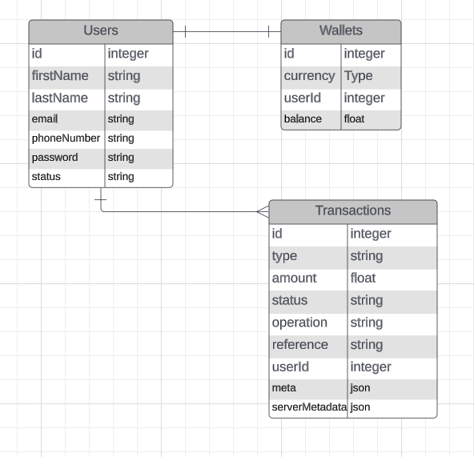

# Wallet Service Backend Documentation

Welcome to the documentation for the FundTransfer backend code. This application allows users to create accounts, fund their accounts, transfer funds to other users, and withdraw funds. The backend is built using NestJS, KnexJS ORM, and MySQL database, with PayStack integration for funding and Docker support. This documentation provides a comprehensive guide to understanding, setting up, and running the backend application.

## Table of Contents

- [Features](#features)
- [Tech Stack](#tech-stack)
- [Prerequisites](#prerequisites)
- [Getting Started](#getting-started)
  - [Installation](#installation)
  - [Configuration](#configuration)
  - [Database Setup](#database-setup)
- [Usage](#usage)
  - [Running Locally](#running-locally)
  - [Running Tests](#running-tests)
- [API Endpoints](#api-endpoints)
- [ER Diagram](#er-diagram)

## Features

- User account creation
- Account funding via PayStack
- Funds transfer between user accounts
- Withdrawal of funds from user accounts

## Tech Stack

- NestJS
- KnexJS ORM
- MySQL database
- PayStack integration
- Docker

## Prerequisites

- Node.js (version 16.X.X)
- MySQL (version 5.X.)
- Docker (if running with Docker)

## Getting Started

### Installation

1. Clone this repository:

   ```bash
   git clone https://github.com/sogunshola/basic-wallet-nestjs-knex
   ```

2. Navigate into the cloned repository folder and install dependencies:

   ```bash
   cd basic-wallet-nestjs-knex
   ```

3. Install dependencies:

   ```bash
   yarn install
   ```

### Configuration

1. Rename `.env.example` to `.env` and configure environment variables:

### Database Setup

1. Create a MySQL database with the name specified in `.env`.

2. Run database migrations:

   ```bash
   yarn knex migrate:latest
   ```

### Usage

#### Running Locally

Start the application locally:

```bash
yarn start:dev
```

Docker can also be used to run the application locally. Follow these steps:

1. Build the Docker image:

   ```bash
   docker-compose up --build
   ```

2. Start the Docker container:

   ```bash
    docker-compose up
   ```

### Running Tests

Run unit tests:

```bash
yarn test
```

### API Endpoints

Explore the API endpoints and their documentation using Swagger:

- **POST** `/api/auth/sign-up` - Create a new user account
- **POST** `/api/wallet/fund` - Fund user's account via PayStack
- **POST** `/api/wallet/transfer` - Transfer funds to another user's account
- **POST** `/api/wallet/withdraw` - Withdraw funds from user's account

For more details and interactive testing, visit the Swagger documentation for the API http://localhost:3000/swagger.

## ER Diagram


